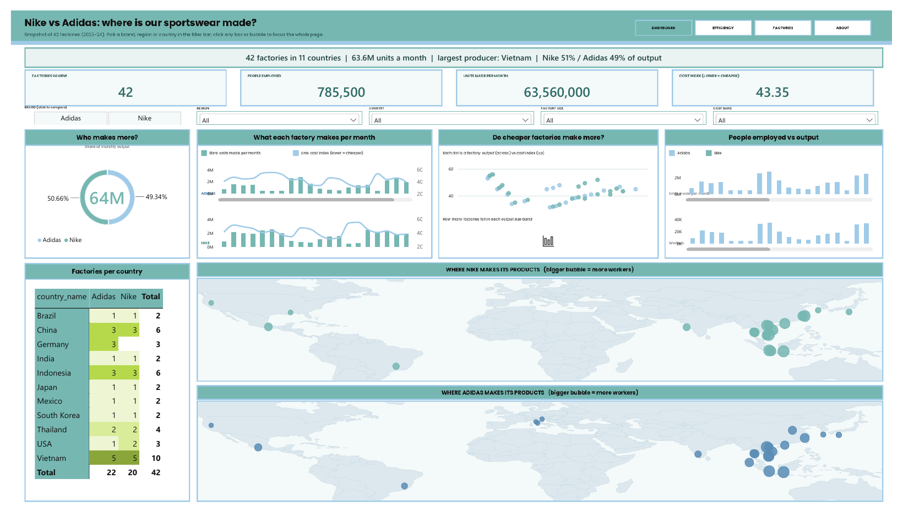

# Nike vs Adidas — Global Supply Chain Intelligence

> **Competitive manufacturing analysis** | PostgreSQL · Tableau · Power BI | 42 factories · 11 countries · 2 years


[](https://public.tableau.com/app/profile/brian.ma5935/viz/BrianNikeAdidas/Dashboard4)
[](https://github.com/brianphu2310/NIKE-AND-ADIDAS-SUPPLY-CHAIN/raw/main/powerbi/nike_adidas_dashboard.pbix)
[](https://github.com/brianphu2310)
[](https://www.linkedin.com/in/brian-phu-data-analysta55353390/)

---

## At a glance

[](https://github.com/brianphu2310/NIKE-AND-ADIDAS-SUPPLY-CHAIN/actions)

| | |
|---|---|
| **Question** | Where do Nike and Adidas make their products, and how exposed is each brand to geographic concentration? |
| **What I built** | PostgreSQL schema and queries over 42 factories in 11 countries, HHI concentration analysis, Tableau and Power BI dashboards. |
| **Key results** | Vietnam and Indonesia hold about 40% of all factories (shared risk for both brands). Adidas keeps 3 factories in Germany; Nike has none in Europe. US plants are low-volume, high-efficiency sites rather than production hubs. |
| **Proof** | CI green, 38 tests (data quality, pipeline, queries, docs freshness). |
| **Honest limits** | The 42-row dataset is compiled, not scraped: the public factory pages returned no usable data, so no scraping is claimed. Cost is a normalised index, not audited financials. |

## The Business Problem

Supply chain strategy is one of the most consequential levers in footwear. Nike and Adidas together represent ~$70B in annual revenue — yet their manufacturing footprints are rarely compared at the factory level. This project answers a question that any supply chain analyst, sourcing manager, or competitive intelligence team would ask:

> *Where exactly do these two brands make their products — and what does that reveal about their cost structure, risk exposure, and strategic priorities?*

---

## Analytical Framework (OODA)

This project follows the **Observe → Orient → Decide → Act** loop as a structuring principle for supply chain competitive analysis.

| Phase | Question | Answered By |
|---|---|---|
| **Observe** | Where are the factories? How large are they? | Geographic bubble map, country cross-tab |
| **Orient** | What patterns emerge across cost, output, and scale? | Monthly Output combo chart, Cost & Output histogram |
| **Decide** | Which markets represent concentration risk or strategic advantage? | Workers vs Output dual-axis, key findings |
| **Act** | What should a sourcing team do differently? | Recommendations & further exploration |

---

## KPIs Tracked

| Metric | Definition | Business Relevance |
|---|---|---|
| **Monthly Output** | Units produced per factory per month | Capacity utilisation proxy |
| **Production Cost Index** | Normalised USD cost per factory | Cross-country cost benchmarking |
| **Output per Worker** | `monthly_output / workers` | Labour efficiency / automation signal |
| **Cost per Million Units** | `SUM(cost) / SUM(output) × 1M` | True unit economics across geographies |
| **Factory Count by Country** | Factories per brand per market | Geographic concentration & risk exposure |
| **Workers per Factory** | Average headcount | Scale strategy (mega-factory vs distributed) |

---

## Dashboard — Chart-by-Chart Breakdown

### 1. Geographic Bubble Map (split by brand)
**What it shows:** Each bubble = one factory. Size encodes workforce headcount; colour encodes monthly output (teal = high, yellow = low).

**Business read:** Southeast Asia dominates both maps. Vietnam and Indonesia form a dense cluster of large, high-output factories for both brands. The US and Germany bubbles are visibly smaller — low output relative to headcount, consistent with R&D/innovation facility profiles rather than volume manufacturing.

---

### 2. Monthly Output + Production Cost (combo chart)
**What it shows:** Bars = monthly output by factory; line overlay = production cost index. Faceted by brand (Adidas top, Nike bottom).

**Business read:** The combo chart tests a key assumption — that higher output comes at higher cost. The pattern is **non-linear**: Southeast Asian factories post the highest output *and* relatively low cost, while Western factories have low output *and* high cost. This confirms that geography, not scale, is the primary cost driver.

---

### 3. Cost and Output Distribution (binned histogram)
**What it shows:** Factories binned by monthly output range; count shown per bin, split by brand.

**Business read:** Both brands cluster in the 1.5M–2.8M unit/month range for their core factories. Adidas has a slightly right-skewed distribution — a few factories exceed 2.6M units/month (Surabaya: 2.8M). Nike's distribution is more uniform. Neither brand has factories in the 3M+ range, suggesting a ceiling on current facility scale.

---

### 4. Workers and Output (dual-axis)
**What it shows:** Monthly output (bar) and worker headcount (bar) plotted side-by-side per factory, coloured by brand.

**Business read:** The two series generally move together — but divergences are meaningful. Factories where output is high relative to workers signal **higher automation or process efficiency**. Adidas Surabaya (35K workers, 2.8M units = **80 units/worker/month**) outperforms Nike Ho Chi Minh (35K workers, 2.5M units = **71.4 units/worker/month**) on this metric.

---

### 5. Country × Brand Cross-Tab
**What it shows:** Factory count per country per brand, formatted as a heatmap table.

**Business read:** Vietnam (5–5), Indonesia (3–3), China (3–3), Thailand (2–2) show **symmetric competition** — both brands have matched each other's factory footprint. Germany (Adidas 3, Nike 0) and USA (Nike 2, Adidas 1) are the asymmetries that reveal strategic divergence.

---

## Power BI Dashboard

The Tableau dashboard above is kept. The same data is also rebuilt in Power BI as a one-glance report for managers and HR: a summary line ("42 factories in 11 countries | 63.6M units a month | largest producer: Vietnam"), brand / region / country / size / cost-band filters, and plain-English chart titles ("Do cheaper factories make more?").



| Page | What it answers |
|---|---|
| Dashboard | Who makes more, monthly output vs cost, factories per country, one bubble map per brand |
| Efficiency | Do bigger workforces make more, cheapest regions, most productive factories, country summary |
| Factories | Every site, one row per factory |
| About | Definitions, provenance and limits |

- File: [`powerbi/nike_adidas_dashboard.pbix`](powerbi/nike_adidas_dashboard.pbix). All four pages: [`docs/powerbi/`](docs/powerbi/).
- Model: star schema from the repo's ETL (`dim_brand`, `dim_country`, `dim_location`, `dim_factory`, `dim_year`, `fact_factory_snapshot`).
- Limits: the dataset is constructed from public information, not audited company data. Each factory has one reference year, so this is a snapshot, not a trend. Cost index is relative, not a dollar amount. Maps are bubbles on longitude / latitude over a drawn outline.

---

## Key Findings & Business Implications

### Finding 1 — Southeast Asia is non-negotiable for both brands
Vietnam and Indonesia account for **~40% of all factories** and the majority of volume output. Any supply chain disruption in these markets (labour unrest, trade policy, natural disaster) would hit both brands simultaneously — limiting competitive arbitrage but raising systemic risk.

**Implication:** Both brands face correlated risk. A sourcing team should model Vietnam/Indonesia disruption scenarios as a shared industry exposure, not just a brand-level risk.

---

### Finding 2 — Adidas has a deliberate domestic manufacturing strategy; Nike does not
Adidas maintains **3 factories in Germany** (Berlin, Munich, Herzogenaurach — its HQ city). Nike has zero European factories. Germany's cost index of 53–56 is the highest in the dataset (level with the USA), yet Adidas sustains this deliberately.

**Implication:** These are likely **Speedfactory-adjacent** or premium-line facilities — where proximity to design teams, sustainability optics, and made-in-Germany positioning justify the cost premium. Nike's absence suggests a different brand architecture where "innovation" and "manufacturing" are geographically separated.

---

### Finding 3 — Western factories are R&D infrastructure, not production assets
US factories (Nike Portland/Memphis, Adidas Portland) produce ~480K–550K units/month against 20K–35K-worker Asian factories producing 1.7M–2.8M. Output per worker at US sites is roughly **100 units/month vs 70–80 in Asia** — higher efficiency but far lower absolute volume.

**Implication:** These facilities should not be benchmarked against Asian factories on output metrics. Their value is in speed-to-market, IP development, and being close to the North American consumer. A different KPI set applies — prototype cycle time, SKU variety, lead time to retail.

---

### Finding 4 — Adidas has a small but consistent output-efficiency edge
Adidas Surabaya leads the dataset at **80 units/worker/month**. Across the full dataset, Adidas averages slightly higher output per worker than Nike in matched geographies (Vietnam, Indonesia, Thailand). This may reflect higher automation investment or leaner factory layouts.

**Implication:** A 5–10% efficiency gap compounded across 20M+ units/month is material. If real, it represents a structural cost advantage for Adidas in volume markets.

---

### Finding 5 — China is a diminishing but not exited position
Both brands have 3 factories in China — but cost (45–52) is significantly higher than Vietnam/Indonesia (35–47) with comparable or lower output. No brand has exited; both appear to maintain China for **market-proximity manufacturing** (selling into China) rather than export-oriented production.

**Implication:** The China+1 story is real, but it's a slow rebalancing rather than an exit. Brands need Chinese factories to serve Chinese consumers without import tariffs. Analysts should separate China-for-China from China-for-export in any risk model.

---

## Further Exploration

The current dataset opens several analytical extensions worth building:

**1. Concentration Risk Score**
Model a Herfindahl-Hirschman Index (HHI) by country for each brand. A high HHI signals dangerous geographic concentration. Vietnam HHI for both brands is currently high.

**2. Efficiency Frontier Analysis**
Plot all factories on an output-per-worker vs production-cost scatter. Factories in the top-left quadrant (high efficiency, low cost) define the frontier. Identify which brand has more factories on that frontier.

**3. ESG Layer**
Overlay fair labour ratings and environmental compliance scores by country. Does the lowest-cost geography also carry the highest social risk? This reframes the cost index as a risk-adjusted cost index.

**4. Category-to-Factory Mapping**
Assign product lines (running, lifestyle, performance, apparel) to factories based on public sourcing disclosures. Does Nike concentrate running shoe production in different geographies than Adidas?

**5. Trade Policy Sensitivity Model**
Simulate the cost impact of a 15% tariff increase on Vietnam or Indonesia exports. Which brand's cost structure is more exposed? Which has more geographic flexibility to absorb or redirect?

---

## SQL Pipeline

### Schema

```sql
CREATE TABLE factories (
    factory_id      SERIAL PRIMARY KEY,
    brand           VARCHAR(20),
    factory_code    VARCHAR(20),
    country         VARCHAR(50),
    city            VARCHAR(50),
    year            INT,
    workers         INT,
    monthly_output  INT,
    production_cost DECIMAL(10,2),
    latitude        FLOAT,
    longitude       FLOAT
);
```

### Core Analytical Queries

```sql
-- Output efficiency per worker (efficiency frontier input)
SELECT brand, country, city, workers, monthly_output,
       ROUND(monthly_output::DECIMAL / workers, 1) AS output_per_worker
FROM factories
ORDER BY output_per_worker DESC;

-- Normalised cost per million units by brand
SELECT brand,
       ROUND(SUM(production_cost) / SUM(monthly_output) * 1000000, 2) AS cost_per_million_units
FROM factories
GROUP BY brand;

-- Geographic concentration (HHI by brand)
WITH country_output AS (
    SELECT brand, country,
           SUM(monthly_output) AS country_output,
           SUM(SUM(monthly_output)) OVER (PARTITION BY brand) AS total_output
    FROM factories GROUP BY brand, country
)
SELECT brand,
       ROUND(SUM(POWER(country_output::DECIMAL / total_output * 100, 2)), 1) AS hhi_score
FROM country_output
GROUP BY brand;

-- Cost index vs output by geography (combo chart source)
SELECT brand, country, city,
       AVG(production_cost)  AS avg_cost,
       SUM(monthly_output)   AS total_output,
       SUM(workers)          AS total_workers
FROM factories
GROUP BY brand, country, city
ORDER BY brand, total_output DESC;
```

### Coordinate Jitter for Tableau

Prevents overlapping markers when factories share a city. `setseed(0.42)` ensures reproducibility across runs.

```sql
SELECT setseed(0.42);
UPDATE factories SET
    latitude  = latitude  + (random() * 0.09 - 0.045),
    longitude = longitude + (random() * 0.09 - 0.045) / cos(radians(latitude));
```

---

## Dataset

**`data/nike_adidas_factories.csv`** — 42 rows · 11 columns · 11 countries · 2023–2024

| Column | Type | Description |
|---|---|---|
| `factory_id` | INT | Surrogate key |
| `brand` | VARCHAR | Nike or Adidas |
| `factory_code` | VARCHAR | Human-readable ID (`NK-VN-01`) |
| `country` | VARCHAR | Factory country |
| `city` | VARCHAR | City-level precision |
| `year` | INT | 2023 or 2024 |
| `workers` | INT | Total headcount |
| `monthly_output` | INT | Units produced per month |
| `production_cost` | DECIMAL | Normalised cost index (USD) |
| `latitude` / `longitude` | FLOAT | Coordinates for Tableau mapping |

---

## Data Engineering

Beyond the Tableau dashboard, the repo contains a small, tested ETL pipeline and a SQLite star schema built from the same CSV.

```bash
pip install -r requirements-dev.txt
python -m pipeline            # extract -> validate -> transform -> load  (writes warehouse.db, docs/DATA_QUALITY.md)
python -m pipeline.docgen     # regenerate docs/DATA_DICTIONARY.md from the warehouse
python sql/run_queries.py     # run sql/analysis/*.sql -> docs/query_results/*.csv
python -m pytest -q           # 38 tests: data quality, pipeline, queries, docs freshness
```

| Stage | What it does | Code |
|---|---|---|
| Extract | Reads the CSV; also parses the `INSERT` rows of the PostgreSQL script for reconciliation | `pipeline/extract.py` |
| Validate | 31 checks (schema, nulls, duplicates, ranges, referential, consistency, outliers, CSV-vs-SQL); report written to [`docs/DATA_QUALITY.md`](docs/DATA_QUALITY.md); errors block the load | `pipeline/validate.py` |
| Transform | Cleans, derives `output_per_worker`, `cost_index_per_million_units`, size/cost tiers; builds dimensions with surrogate keys | `pipeline/transform.py` |
| Load | Creates `warehouse.db` (gitignored) from `pipeline/schema.sql`: `dim_` / `fact_` tables, FKs, indexes, a flat view | `pipeline/load.py` |

- **Model:** [`docs/DATA_MODEL.md`](docs/DATA_MODEL.md) (Mermaid ER diagram, grain, keys) and [`docs/DATA_DICTIONARY.md`](docs/DATA_DICTIONARY.md) (every column, generated from the warehouse).
- **Analysis SQL:** 10 SQLite queries in [`sql/analysis/`](sql/analysis/) using CTEs, window functions (`RANK`, `LAG`, `PERCENT_RANK`, running totals), self-joins and `CASE`; outputs committed in [`docs/query_results/`](docs/query_results/).
- **Skills map:** [`docs/SKILLS_DEMONSTRATED.md`](docs/SKILLS_DEMONSTRATED.md).
- **Honest scope:** each factory has one row with one reference year, so the model is a snapshot rather than a time series. The data is constructed from public information (see the note at the bottom), not audited company figures.

---

## Project Structure

```
NIKE-AND-ADIDAS-SUPPLY-CHAIN/
├── README.md
├── data/
│   └── nike_adidas_factories.csv    # 42 factories, the Tableau data source
├── sql/
│   ├── nike_adidas_factories.sql    # Original PostgreSQL schema, data insert and queries
│   ├── analysis/                    # 10 SQLite analytical queries (CTEs, window functions)
│   └── run_queries.py               # Runs them and writes docs/query_results/*.csv
├── pipeline/                        # ETL: extract, validate, transform, load (SQLite star schema)
├── docs/                            # DATA_MODEL, DATA_DICTIONARY, DATA_QUALITY, SKILLS_DEMONSTRATED, query_results/
├── tests/                           # Dataset, pipeline and query tests
└── .github/workflows/ci.yml         # Tests, end-to-end pipeline run, docs-freshness check
```

## How to Run

```bash
psql -U postgres
\i 'sql/nike_adidas_factories.sql'
COPY factories TO '/tmp/nike_adidas_factories.csv' DELIMITER ',' CSV HEADER;
```

Run the data-quality checks (optional): `pip install -r requirements-dev.txt && python -m pytest -q`

Load `data/nike_adidas_factories.csv` into Tableau Public → assign `latitude` and `longitude` as geographic roles → connect to dashboard template.

---

## Roadmap

| Priority | Item | Business Value |
|---|---|---|
| High | Add YoY data for all cities (2023 + 2024 per factory) | Enables trend analysis and China+1 narrative |
| High | Supplier ESG compliance scores | Risk-adjusted cost index |
| Medium | Decompose `production_cost` → labour / materials / logistics | True cost driver visibility |
| Medium | Product category per factory | Category-level sourcing strategy |
| Low | Port to dbt + BigQuery | Production-grade pipeline for portfolio |

---

*Self-initiated project. Factory data was constructed for analytical purposes based on publicly available information about Nike and Adidas manufacturing locations.*

---

**Brian Ma**
[](https://github.com/brianphu2310)
[](https://www.linkedin.com/in/brian-phu-data-analysta55353390/)
