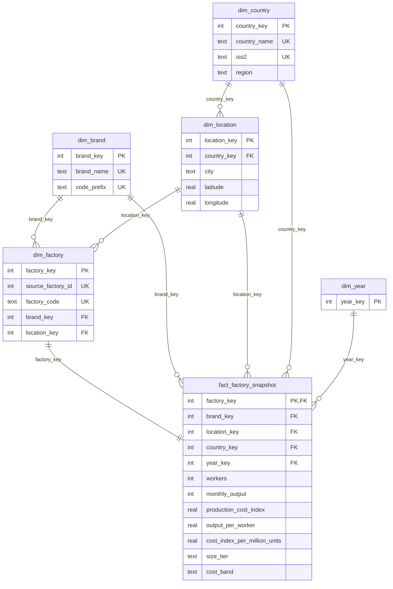

# Data Model

The warehouse (`warehouse.db`, SQLite, gitignored) is rebuilt from `data/nike_adidas_factories.csv` by `python -m pipeline`.
DDL: [`pipeline/schema.sql`](../pipeline/schema.sql). Column-level detail: [DATA_DICTIONARY.md](DATA_DICTIONARY.md).

## Grain

**One row in `fact_factory_snapshot` = one factory (one `factory_code`) with the single reference year its source row carries (2023 or 2024).**

Consequences worth knowing before querying:

- It is a **snapshot**, not a time series: each factory appears once, so there is no year-over-year change per factory. `dim_year` exists so a future multi-year load slots in without remodelling.
- `production_cost_index` is the CSV's `production_cost`, a normalised index, not an absolute cost.
- The source describes the data as constructed for analytical purposes from public information about manufacturing locations; do not read results as audited company figures.

## Entity-relationship diagram

## Keys

| Table | Primary key | Natural / unique key | Foreign keys |
|---|---|---|---|
| `dim_brand` | `brand_key` (surrogate) | `brand_name`, `code_prefix` | none |
| `dim_country` | `country_key` (surrogate) | `country_name`, `iso2` | none |
| `dim_location` | `location_key` (surrogate) | (`country_key`, `city`) | `country_key` |
| `dim_factory` | `factory_key` (surrogate) | `factory_code`, `source_factory_id` | `brand_key`, `location_key` |
| `dim_year` | `year_key` (calendar year, natural) | n/a | none |
| `fact_factory_snapshot` | `factory_key` | n/a | `factory_key`, `brand_key`, `location_key`, `country_key`, `year_key` |

Surrogate keys are assigned deterministically (sorted by name or `factory_code`), so reloads give identical keys.
SQLite enforces foreign keys (`PRAGMA foreign_keys = ON`) and the loader runs `PRAGMA foreign_key_check` after loading.

## Design notes

- **Snowflake branch**: `dim_country -> dim_location -> dim_factory` keeps country attributes (region, ISO code) in one place.
- **Denormalised keys on the fact** (`brand_key`, `location_key`, `country_key`) let queries filter and group without walking the branch.
- **Derived columns** (`output_per_worker`, `cost_index_per_million_units`, `size_tier`, `cost_band`) are computed in `pipeline/transform.py`; tier thresholds are analyst-defined, documented in the dictionary.
- **`region`** is an analyst-defined grouping held in `COUNTRY_REF` (`pipeline/validate.py`); it is not in the source CSV.
- **Indexes** on every foreign key of the fact table plus `dim_location.country_key` and `dim_factory.brand_key`.
- **`vw_factory_flat`** pre-joins everything; all queries in `sql/analysis/` read from it.
